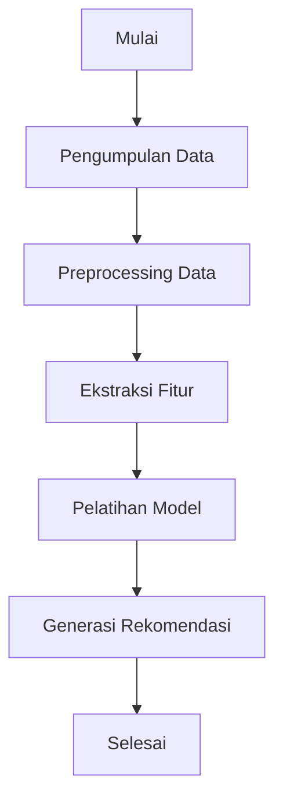

# Development of an E-Book Recommendation System Based on Opening Chess Weakness Analysis

## 2. Ringkasan dan Permasalahan Project + Tujuan yang Akan Dicapai + Model / Alur Penyelesaian

### Ringkasan
Proyek ini bertujuan untuk mengembangkan sistem rekomendasi e-book yang menyarankan buku berdasarkan analisis kelemahan dalam pembukaan catur. Sistem ini menggunakan teknik pengambilan data untuk menemukan e-book yang relevan dan memberikan rekomendasi yang dapat membantu pemain catur meningkatkan pemahaman dan strategi mereka dalam pembukaan permainan.

### Permasalahan
Permasalahan utama yang ingin diselesaikan oleh proyek ini adalah:
- Bagaimana cara menganalisis kelemahan pembukaan tanpa perlu pakai aplikasi berbayar 600k/tahun?
- Bagaimana cara merekomendasikan e-book yang relevan berdasarkan analisis kelemahan pembukaan catur?

### Tujuan yang Akan Dicapai
Tujuan dari proyek ini adalah:
- Menghemat biaya dan mengidentifikasi kelemahan pada fase pembukaan.
- Merekomendasikan e-book yang relevan untuk membantu pemain catur meningkatkan pemahaman mereka tentang pembukaan yang efektif.

### Model / Alur Penyelesaian
Berikut adalah bagan alur penyelesaian proyek:

## 3. Penjelasan Dataset, EDA dan Proses Features Dataset

### Penjelasan Dataset
Dataset yang digunakan dalam proyek ini terdiri dari dua bagian:
1. **Data Retrieval Dataset**: Dataset ini terdiri dari 7 e-book dalam format PDF dan DOCX yang mencakup berbagai topik terkait strategi catur, terutama teori pembukaan.
2. **Opening Weakness Analysis Dataset**: Dataset untuk menganalisis kelemahan pembukaan terdiri dari data permainan PGN pribadi yang diperoleh dari Chess.com melalui OpeningTree.com.

### Exploratory Data Analysis (EDA)
EDA dilakukan untuk memahami struktur dan karakteristik dataset. Langkah-langkah EDA meliputi:
- Memuat file PGN dan mengurai permainan catur.
- Menghitung jumlah permainan untuk setiap pembukaan.
- Menghitung win rate untuk setiap pembukaan berdasarkan warna.

### Proses Features Dataset
Proses features dataset meliputi:
- Mengurai permainan catur menjadi daftar gerakan dan hasil.
- Mengelompokkan permainan berdasarkan pembukaan.
- Menghitung jumlah permainan dan win rate untuk setiap pembukaan.

## 4. Proses Learning / Modeling

Proses learning atau modeling dalam proyek ini meliputi:
- Memuat file PGN dan mengurai permainan catur.
- Menghitung win rate untuk setiap pembukaan berdasarkan warna.
- Menampilkan hasil analisis dalam bentuk tabel.
- Memberikan rekomendasi pembukaan yang perlu dipelajari lebih lanjut berdasarkan win rate terendah.

## 5. Performa Model

Performa model diukur berdasarkan kemampuan aplikasi untuk:
- Memuat dan mengurai file PGN dengan benar.
- Menghitung win rate untuk setiap pembukaan dengan akurat.
- Menampilkan hasil analisis dalam bentuk yang mudah dipahami oleh pengguna.
- Memberikan rekomendasi pembukaan yang relevan berdasarkan win rate.

## 6. Diskusi Hasil dan Kesimpulan

### Diskusi Hasil
Hasil analisis menunjukkan bahwa aplikasi Chess Analyzer dapat membantu pemain catur mengidentifikasi kelemahan pada fase pembukaan. Aplikasi ini berhasil menghitung win rate untuk setiap pembukaan dan memberikan rekomendasi pembukaan yang perlu dipelajari lebih lanjut.

### Kesimpulan
Proyek Chess Analyzer berhasil mencapai tujuan yang ditetapkan. Aplikasi ini dapat memuat file PGN, menganalisis permainan catur, menghitung win rate untuk setiap pembukaan, dan memberikan rekomendasi pembukaan yang perlu dipelajari lebih lanjut. Aplikasi ini dapat digunakan oleh pemain catur untuk meningkatkan permainan mereka dengan fokus pada pembukaan yang memiliki win rate terendah.

## Project Description

This project aims to develop an **e-book recommendation system** that suggests books based on the analysis of weaknesses in chess openings. The system utilizes **data retrieval techniques** to find relevant e-books and provide recommendations that can help chess players improve their understanding of and strategies for opening play.

The project uses **personal PGN data** obtained from chess games on Chess.com, which is then analyzed using **data mining techniques**. The results of this analysis are used to recommend e-books focused on improving players' performance in chess openings that are identified as weak.

## Key Features
- **Chess Opening Weakness Analysis**: Identifies ineffective or suboptimal openings based on personal PGN game data.
- **E-Book Recommendations**: Suggests relevant e-books in PDF and DOCX formats to help improve understanding of effective chess openings.
- **Data Retrieval**: Retrieves and recommends e-books based on the identified weaknesses in a player's chess openings.

## Datasets

### 1. **Data Retrieval Dataset**  
This dataset consists of **7 e-books** in **PDF and DOCX** formats, covering various topics related to chess strategy, particularly opening theory. These e-books are used to recommend books based on the analysis of weaknesses in chess openings.

### 2. **Opening Weakness Analysis Dataset**  
The dataset for analyzing opening weaknesses consists of **personal PGN game data** obtained from **Chess.com** via **OpeningTree.com**. This data is converted into personal **PGN files** and used to analyze the effectiveness of different chess openings in personal games.

## Workflow

1. **Data Collection**: Collect chess game data (PGN files) and e-books.
2. **Data Preprocessing**: Clean the PGN data and e-book text (lowercasing, stemming, stopword removal).
3. **Feature Extraction**: Use techniques like **TF-IDF** and **word embeddings** to extract relevant features from game data and e-books.
4. **Model Training**: Train a machine learning model, such as **Support Vector Machine (SVM)**, to classify chess openings as optimal or suboptimal.
5. **Recommendation Generation**: Based on the analysis of opening weaknesses, the system generates recommendations for relevant e-books.
